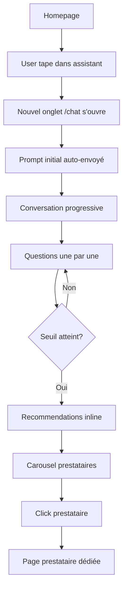

# Assistant Événementiel GetSoundOn - Analyse Technique Complète

**Analyse réalisée par un Staff Product Engineer + Senior Full-Stack Architect + Senior Frontend Engineer + TypeScript System Designer expert en LLM**

## Table des Matières

1. [Vue d'Ensemble du Système](#vue-densemble-du-système)
2. [Architecture TypeScript & Domain Design](#architecture-typescript--domain-design)
3. [Système de Parsing et Extraction NLP](#système-de-parsing-et-extraction-nlp)
4. [Moteur de Qualification Conversationnelle](#moteur-de-qualification-conversationnelle)
5. [Système de Recommandation Métier](#système-de-recommandation-métier)
6. [Algorithme de Matching Prestataires](#algorithme-de-matching-prestataires)
7. [Architecture React & Gestion d'État](#architecture-react--gestion-détat)
8. [Interface Utilisateur & UX Flow](#interface-utilisateur--ux-flow)
9. [Garde-fous et Contraintes Métier](#garde-fous-et-contraintes-métier)
10. [Limitations Actuelles & Recommandations](#limitations-actuelles--recommandations)

---

## Vue d'Ensemble du Système

### Objectif Métier

L'Assistant Événementiel GetSoundOn est un système conversationnel spécialisé qui transforme des intentions événementielles floues en recommandations techniques concrètes et en matching de prestataires locaux.

**Mission principale :** 
- Transformer `"je ne sais pas quoi louer pour mon événement"` 
- En `"voici une configuration adaptée et les prestataires pertinents"`

### Architecture Hybride

Le système combine :
- **NLP basique** : Parsing par regex et mots-clés (pas de LLM externe)
- **Logique métier structurée** : Règles business event-tech spécifiques
- **Machine à états conversationnelle** : Qualification progressive
- **Algorithmes de scoring** : Matching prestataires multi-critères

### Stack Technique

```typescript
// Core Stack
- Next.js 16.1.7 (App Router + Server Actions)
- React 18 + TypeScript strict mode
- Tailwind CSS + shadcn/ui
- Local Storage persistence
- Geen LLM externe (système purement basé sur les règles)

// Architecture Pattern
- Domain-Driven Design (DDD)
- Functional programming (pure functions)
- Event-driven state management
- Progressive enhancement
```

---

## Architecture TypeScript & Domain Design

### Modèle de Domaine Événementiel

Le système est construit autour d'un **rich domain model** TypeScript qui capture la complexité métier :

```typescript
// Types fondamentaux
export type EventType = 
  | "conference" | "corporate" | "birthday" | "private_party" 
  | "wedding" | "cocktail" | "showcase" | "dj_set" | "religious_service"
  | "product_launch" | "screening" | "outdoor_event" | "other" | "unknown";

export type ServiceNeed = 
  | "sound" | "microphones" | "dj" | "lighting" | "led_screen"
  | "video" | "audiovisual" | "delivery" | "installation" | "technician" | "full_service";
```

### Source of Truth : EventBrief

Le **EventBrief** est la structure centrale qui accumule les informations extraites :

```typescript
export type BriefField<T> = {
  value: T | null;
  confidence: number;           // 0 to 1
  extractionType?: ExtractionType;    // "explicit" | "inferred" | "assumed"  
  confirmationStatus: ConfirmationStatus; // "confirmed" | "unconfirmed" | "needs_confirmation"
  sourceMessageIds: string[];   // Traçabilité des sources
  lastUpdatedAt?: string;
};

export type EventBrief = {
  eventType: BriefField<EventType>;
  guestCount: BriefField<number>;
  location: BriefField<LocationData>;
  venueType: BriefField<VenueType>;
  indoorOutdoor: BriefField<IndoorOutdoor>;
  eventDate: BriefField<DateData>;
  serviceNeeds: BriefField<ServiceNeed[]>;
  deliveryNeeded: BriefField<boolean>;
  installationNeeded: BriefField<boolean>;
  technicianNeeded: BriefField<boolean>;
  budgetRange: BriefField<BudgetData>;
  constraints: BriefField<string[]>;
  specialNotes: BriefField<string[]>;
};
```

**Caractéristiques architecturales importantes :**

- **Immutable by design** : Chaque modification crée un nouveau brief
- **Confidence tracking** : Chaque champ a un niveau de confiance
- **Source traceability** : Traçabilité complète des messages sources
- **Conflict resolution** : Gestion des contradictions par confidence score
- **Progressive accumulation** : Les champs se complètent au fil de la conversation

### États de Qualification

```typescript
export type QualificationState = {
  stage: QualificationStage;
  knownFields: QuestionField[];
  missingCriticalFields: QuestionField[];
  missingSecondaryFields: QuestionField[];
  nextQuestionField?: QuestionField;
  nextQuestionReason?: string;
  completionScore: number; // 0 to 100
  minimumViableBriefReached: boolean;
  readyToRecommend: boolean;
};
```

---

## Système de Parsing et Extraction NLP

### Approche Hybride Regex + Heuristiques

Le système n'utilise **pas de LLM externe** mais un parsing sophistiqué basé sur :

#### 1. Détection de Type d'Événement

```typescript
const EVENT_KEYWORDS: Array<{ words: RegExp; type: EventType }> = [
  { words: /\bconf(é|e)rence|séminaire|congr[eè]s/i, type: "conference" },
  { words: /\bcorporate|entreprise|afterwork|team\s?building/i, type: "corporate" },
  { words: /\banniversaire|birthday/i, type: "birthday" },
  { words: /\bmariage|wedding/i, type: "wedding" },
  // ... 15 patterns total
];
```

#### 2. Extraction de Besoins Techniques

```typescript
const NEED_KEYWORDS: Array<{ words: RegExp; need: ServiceNeed }> = [
  { words: /\bsono|sonorisation|enceinte|haut.?parleur|sound\b/i, need: "sound" },
  { words: /\bdj\b|platine|controller|mix/i, need: "dj" },
  { words: /\blumi(è|e)re|light|par led|lyre/i, need: "lighting" },
  { words: /\bmicro|microphone|mic\b/i, need: "microphones" },
  // ... 11 patterns total
];
```

#### 3. Parsing Multi-Format de Dates

```typescript
const DATE_PATTERNS = [
  /\b(?:le\s+)?(\d{1,2}\s+(?:janvier|février|mars|avril|mai|juin|juillet|août|septembre|octobre|novembre|décembre)\s+\d{4})/i,
  /\b(\d{1,2}[\/\-\.]\d{1,2}[\/\-\.]\d{2,4})/,
  /\b(\d{1,2}[\/\-\.]\d{1,2})/
];

function extractDate(text: string): string | undefined {
  for (const pattern of DATE_PATTERNS) {
    const match = text.match(pattern);
    if (match) return match[1].trim();
  }
  return undefined;
}
```

#### 4. Extraction Contextuelle

```typescript
// Nombres d'invités
const AUDIENCE_REGEX = /(\d{2,4})\s*(?:personnes|pers\.?|invités?|guests?)/i;

// Localisation avec prépositions
const CITY_REGEX = /\b(?:à|a|sur|dans|au|en)\s+([A-ZÉÈÎÏÂÀÔÛÙ][\w''\-éèàùôûîïç]+(?:[-\s][A-ZÉÈÎÏÂÀÔÛÙ][\w''\-éèàùôûîïç]+)*)/i;

// Indoor/Outdoor par mots-clés contextuels
function detectIndoorOutdoor(text: string): IndoorOutdoor | undefined {
  if (/\bext[eé]rieur|dehors|plein air|outdoor|jardin|terrasse\b/i.test(text)) {
    return "outdoor";
  }
  if (/\bint[eé]rieur|dedans|salle|h[oô]tel|appartement|bureau\b/i.test(text)) {
    return "indoor";
  }
  return undefined;
}
```

### Système de Confidence & Extraction

Chaque extraction a un **confidence score** basé sur :
- **Explicite** (0.9) : Information directement exprimée
- **Inféré** (0.6-0.85) : Déduction contextuelle
- **Assumé** (0.3-0.5) : Hypothèse par défaut

---

## Moteur de Qualification Conversationnelle

### Algorithme de Progression

Le moteur suit un **algorithme déterministe** de qualification progressive :

#### 1. Pipeline de Processing

```typescript
export function processUserTurn(
  currentBrief: EventBrief, 
  userText: string, 
  userMessageId: string
): ProcessResult {
  // 1. Parse le texte utilisateur
  const parsed = parseEventPrompt(userText);
  
  // 2. Merge avec le brief existant
  let brief = { ...currentBrief };
  brief.eventType = mergeField(brief.eventType, {
    value: parsed.eventType ?? null,
    confidence: confidenceFromExplicit(parsed.eventType),
    extractionType: "explicit",
    confirmationStatus: "confirmed",
    sourceMessageId: userMessageId,
  });
  // ... merge tous les champs
  
  // 3. Compute nouveau qualification state
  const qualification = computeQualificationState(brief);
  const nextField = resolveNextQuestionField(brief, qualification);
  
  // 4. Génère réponse assistant
  const assistantMessage = createAssistantMessage(nextField, qualification);
  
  return { brief, qualification, assistantMessage, nextQuestion };
}
```

#### 2. Priorités de Qualification

```typescript
// Champs critiques (bloquants)
const CRITICAL_FIELDS: QuestionField[] = [
  "eventType", "guestCount", "location", "indoorOutdoor", "serviceNeeds"
];

// Champs secondaires (optimisants)  
const SECONDARY_FIELDS: QuestionField[] = [
  "eventDate", "deliveryNeeded", "installationNeeded", 
  "technicianNeeded", "venueType", "budgetRange", "constraints"
];
```

#### 3. Seuils de Recommandation

```typescript
export function computeQualificationState(brief: EventBrief): QualificationState {
  const minimumViableBriefReached =
    brief.eventType.value !== null &&
    brief.guestCount.value !== null &&
    brief.location.value !== null &&
    brief.indoorOutdoor.value !== null &&
    brief.serviceNeeds.value !== null;
    
  const readyToRecommend = minimumViableBriefReached;
  // ...
}
```

#### 4. Merge Field Strategy

```typescript
export function mergeField<T>(current: BriefField<T>, incoming: MergeOpts<T>): BriefField<T> {
  if (incoming.value === null) return current;
  
  // Si plus haute confidence, remplace
  if ((incoming.confidence ?? 0) >= current.confidence) {
    return {
      ...current,
      value: incoming.value,
      confidence: incoming.confidence ?? current.confidence,
      extractionType: incoming.extractionType ?? current.extractionType,
      confirmationStatus: incoming.confirmationStatus ?? current.confirmationStatus,
      sourceMessageIds: [...current.sourceMessageIds, incoming.sourceMessageId],
      lastUpdatedAt: new Date().toISOString(),
    };
  }
  
  // Sinon garde le meilleur mais track la source
  return { ...current, sourceMessageIds: [...current.sourceMessageIds, incoming.sourceMessageId] };
}
```

### Anti-Redondance & Mémoire

Le système évite de redemander les informations déjà connues via :

1. **Source tracking** : Chaque info trace ses messages sources
2. **Confidence comparison** : Seules les infos plus fiables remplacent
3. **Field resolution** : Priorité dynamique basée sur les champs manquants
4. **State persistence** : Conversation sauvegardée en localStorage

---

## Système de Recommandation Métier

### Moteur de Règles Business

Le système de recommandation est **entièrement basé sur des règles métier** event-tech :

#### 1. Dimensionnement Automatique

```typescript
function speakersByAudience(audience?: number): number {
  if (!audience) return 2;
  if (audience <= 80) return 2;     // Petit événement
  if (audience <= 200) return 4;    // Événement moyen
  if (audience <= 600) return 6;    // Grand événement
  return 8;                         // Très grand événement
}

function baseSoundPack(audience?: number): UiEquipmentRequirement[] {
  const qty = speakersByAudience(audience);
  return [
    { category: "sound", subcategory: "speakers", quantity: qty, label: `${qty} enceintes actives` },
    { category: "sound", subcategory: "mixer", quantity: 1, label: "Console de mixage" },
  ];
}
```

#### 2. Logique Contextuelle par Type d'Événement

```typescript
function microphonePack(needs: Set<string>, eventType?: string, audience?: number): UiEquipmentRequirement[] {
  if (needs.has("microphones") || eventType === "conference") {
    const count = audience && audience > 150 ? 3 : 2;
    return [
      { category: "microphone", subcategory: "wireless", quantity: count, label: `${count} micros sans fil` },
    ];
  }
  return [];
}

function djPack(needs: Set<string>, eventType?: string): UiEquipmentRequirement[] {
  if (needs.has("dj") || eventType === "dj_set" || eventType === "birthday" || eventType === "private_party") {
    return [
      { category: "dj", subcategory: "controller", quantity: 1, label: "Contrôleur / platines DJ" },
      { category: "dj", subcategory: "monitor", quantity: 2, label: "Retours DJ" },
    ];
  }
  return [];
}
```

#### 3. Génération Multi-Tier

Le système génère 3 niveaux de recommendations :

```typescript
export function buildRecommendedSetups(brief: EventBrief): UiRecommendedSetups {
  const audience = brief.guestCount.value;
  const eventType = brief.eventType.value;
  const needs = new Set(brief.serviceNeeds.value || []);

  return {
    tiers: [
      {
        id: "essential",
        title: "Configuration Essentielle",
        items: [...baseSoundPack(audience)],
        services: ["livraison"],
        rationale: "Le minimum viable pour votre événement"
      },
      {
        id: "standard", 
        title: "Configuration Standard",
        items: [...baseSoundPack(audience), ...microphonePack(needs, eventType, audience)],
        services: ["livraison", "installation"],
        rationale: "Configuration équilibrée avec installation"
      },
      {
        id: "premium",
        title: "Configuration Premium", 
        items: [...allPacks(audience, eventType, needs)],
        services: ["livraison", "installation", "technicien"],
        rationale: "Configuration complète avec accompagnement technique"
      }
    ],
    summary: `Recommandations pour ${eventType} de ${audience} personnes`
  };
}
```

### Intelligence Métier Event-Tech

Le système encode des **connaissances expertes** du domaine :

- **Weddings** → Microphones sans fil + éclairage romantique
- **Corporate** → Priorité micro + écran LED pour présentations  
- **DJ Sets** → Retours DJ obligatoires + effets lumineux
- **Conferences** → Multi-micros + sonorisation claire
- **Outdoor** → Puissance accrue + protection IP65

---

## Algorithme de Matching Prestataires

### Scoring Multi-Critères

Le système de matching utilise un **algorithme de scoring pondéré** :

```typescript
export function scoreProviderMatch(
  provider: MatchingProvider,
  brief: EventBrief,
  recommended: UiRecommendedSetups
): { provider: MatchingProvider; score: ProviderScoreBreakdown } {
  
  const materialScore = scoreMaterialMatch(provider, recommended);      // 30%
  const deliveryScore = scoreDeliveryCapability(provider, brief);      // 20% 
  const proximityScore = scoreProximity(provider, brief.location);     // 10%
  const installationScore = scoreInstallation(provider, brief);        // 10%
  const technicianScore = scoreTechnician(provider, brief);            // 10%
  const dateScore = scoreDateAvailability(provider, brief);            // 10%
  const budgetScore = scoreBudget(provider, brief);                    // 5%
  const confidenceScore = scoreProviderConfidence(provider);           // 5%
  
  const total = Math.round(
    materialScore * 0.3 + deliveryScore * 0.2 + proximityScore * 0.1 +
    installationScore * 0.1 + technicianScore * 0.1 + dateScore * 0.1 +
    budgetScore * 0.05 + confidenceScore * 0.05
  );
  
  return {
    provider,
    score: {
      total,
      criteria: { material: materialScore, delivery: deliveryScore, /* ... */ },
      rationale: generateScoreRationale(/* ... */)
    }
  };
}
```

#### Algorithmes de Scoring Spécialisés

```typescript
// Matching du matériel demandé vs capacités prestataire
function scoreMaterialMatch(provider: MatchingProvider, recommended: UiRecommendedSetups): number {
  const neededCategories = extractNeededCategories(recommended);
  const providerCategories = new Set(provider.capabilities.categories);
  
  const matches = neededCategories.filter(cat => {
    return providerCategories.has(cat) || 
           providerCategories.has(CATEGORY_ALIASES[cat]) ||
           providerCategories.has("full_service");
  }).length;
  
  return Math.round((matches / neededCategories.length) * 100);
}

// Scoring de proximité géographique
function scoreProximity(provider: MatchingProvider, location: BriefField<LocationData>): number {
  if (!location.value?.city) return 50; // Neutral si pas de localisation
  
  const providerCity = provider.location.toLowerCase();
  const eventCity = location.value.city.toLowerCase();
  
  if (providerCity.includes(eventCity) || eventCity.includes(providerCity)) {
    return 100; // Même ville = score parfait
  }
  
  // Logique distance/zone géographique (simplifié)
  return 70; // Assume région proche par défaut
}
```

---

## Architecture React & Gestion d'État

### Pattern useReducer avec Persistence

Le state management utilise un **pattern useReducer centralisé** avec persistence :

```typescript
// State Shape
type AssistantState = {
  messages: ChatMessage[];
  brief: EventBrief;
  qualification: QualificationState;
  status: AssistantStatus;
  isExpanded: boolean;
};

// Actions
type AssistantAction =
  | { type: "USER_MESSAGE"; payload: ChatMessage }
  | { type: "ASSISTANT_MESSAGE"; payload: ChatMessage }
  | { type: "SET_QUALIFICATION"; payload: QualificationState }
  | { type: "SET_BRIEF"; payload: EventBrief }
  | { type: "SET_STATUS"; payload: AssistantStatus }
  | { type: "SET_EXPANDED"; payload: boolean }
  | { type: "RESTORE_STATE"; payload: AssistantState };

// Reducer avec Anti-Duplication
function reducer(state: AssistantState, action: AssistantAction): AssistantState {
  switch (action.type) {
    case "USER_MESSAGE":
      // Garde-fou anti-duplication
      if (state.messages.some(msg => msg.id === action.payload.id)) {
        return state;
      }
      return { ...state, messages: [...state.messages, action.payload], status: "chatting" };
      
    case "ASSISTANT_MESSAGE":
      if (state.messages.some(msg => msg.id === action.payload.id)) {
        return state;
      }
      return { ...state, messages: [...state.messages, action.payload] };
      
    case "RESTORE_STATE":
      return action.payload; // Restauration complète
      
    // ... autres actions
  }
}
```

### Hook Principal useAssistantConversation

```typescript
export function useAssistantConversation() {
  const [state, dispatch] = useReducer(reducer, initialState);
  const hasRestoredRef = useRef(false);
  const isRestoringRef = useRef(false);

  // Restauration depuis localStorage
  useEffect(() => {
    if (!hasRestoredRef.current) {
      hasRestoredRef.current = true;
      const restored = loadFromStorage();
      
      if (restored) {
        dispatch({ type: "RESTORE_STATE", payload: restored });
      } else {
        dispatch({ type: "ASSISTANT_MESSAGE", payload: createWelcomeMessage() });
      }
    }
  }, []);

  // Dérivation des états calculés
  const recommended = useMemo(() => buildRecommendedSetups(state.brief), [state.brief]);
  const rankedProviders = useMemo(
    () => rankProviders(state.brief, recommended, providerPool),
    [state.brief, recommended, providerPool]
  );
  const readyForResults = state.qualification.readyToRecommend;

  // Action principale
  const sendUserMessage = (text: string) => {
    const userMessage = createUserMessage(text);
    dispatch({ type: "USER_MESSAGE", payload: userMessage });

    const result = processUserTurn(state.brief, text, userMessage.id);
    dispatch({ type: "SET_BRIEF", payload: result.brief });
    dispatch({ type: "SET_QUALIFICATION", payload: result.qualification });
    dispatch({ type: "ASSISTANT_MESSAGE", payload: result.assistantMessage });
    dispatch({ type: "SET_STATUS", payload: result.qualification.readyToRecommend ? "ready" : "chatting" });
  };

  return {
    state, recommended, rankedProviders, readyForResults, sendUserMessage, expand
  };
}
```

### Persistence Strategy

```typescript
const STORAGE_KEY = "assistant_inline_session_v1";

function persistToStorage(state: AssistantState) {
  if (typeof window === "undefined") return;
  try {
    localStorage.setItem(STORAGE_KEY, JSON.stringify(state));
  } catch {
    // Silent fail - localStorage peut être plein ou désactivé
  }
}

function loadFromStorage(): AssistantState | null {
  if (typeof window === "undefined") return null;
  try {
    const raw = localStorage.getItem(STORAGE_KEY);
    if (!raw) return null;
    const parsed = JSON.parse(raw) as AssistantState;
    
    // Validation des données critiques
    if (!parsed?.qualification || !parsed?.messages || !parsed?.brief) return null;
    return parsed;
  } catch {
    return null; // JSON corrompu
  }
}
```

---

## Interface Utilisateur & UX Flow

### Architecture de Pages

Le système utilise une **approche multi-page** optimisée :

1. **Homepage (`/`)** : Point d'entrée assistant compact
2. **Chat Page (`/chat`)** : Conversation complète dans nouvel onglet
3. **Provider Pages (`/prestataires/[id]`)** : Pages dédiées prestataires

### Composants UI Modulaires

```typescript
// Composants Chat
- ChatPageLayout      // Layout principal avec header/messages/input
- ChatHeader          // Navigation + branding  
- ChatMessagesArea    // Zone scrollable des messages
- ChatBubble         // Bulles de conversation (user/assistant)
- ChatInputComposer  // Input fixe en bas avec auto-resize
- ProvidersCarousel  // Carousel horizontal des prestataires

// Composants Assistant Legacy (page d'accueil)
- AssistantEntry     // Interface compacte pour premier prompt
```

### UX Flow Optimisé



### Design System

```typescript
// Couleurs
- Orange primary: "bg-orange-500"
- Gray backgrounds: "bg-gray-50" 
- White content: "bg-white"
- Subtle borders: "border-gray-200"

// Spacing rhythm
- Containers: "px-4 py-3"
- Sections: "space-y-4"
- Cards: "p-4" | "px-3 py-2"

// Typography
- Headings: "font-semibold text-gray-900"
- Body: "text-sm text-gray-600"
- Labels: "text-xs text-gray-500"

// Interactive states
- Buttons: "hover:bg-orange-600 disabled:opacity-50"
- Cards: "hover:shadow-md transition-all"
```

---

## Garde-fous et Contraintes Métier

### 1. Validation des Données

```typescript
// Validation des entrées utilisateur
function validateUserInput(text: string): boolean {
  if (text.trim().length === 0) return false;
  if (text.length > 1000) return false; // Limite de caractères
  return true;
}

// Validation des extractions
function validateExtraction(value: unknown, field: QuestionField): boolean {
  switch (field) {
    case "guestCount":
      return typeof value === "number" && value > 0 && value < 100000;
    case "eventType": 
      return typeof value === "string" && EVENT_TYPES.includes(value);
    default:
      return value !== null && value !== undefined;
  }
}
```

### 2. Limites de Confidence

```typescript
// Confidence minimales pour progression
const MIN_CONFIDENCE_THRESHOLDS = {
  eventType: 0.7,        // Doit être assez sûr du type
  guestCount: 0.8,       // Nombre critique pour dimensionnement  
  location: 0.6,         // Peut être approximatif
  indoorOutdoor: 0.7,    // Impact fort sur matériel
  serviceNeeds: 0.8      // Base de la recommandation
};

function shouldAskConfirmation(field: QuestionField, confidence: number): boolean {
  return confidence < MIN_CONFIDENCE_THRESHOLDS[field];
}
```

### 3. Anti-Spam et Rate Limiting

```typescript
// Protection contre messages répétitifs
const MESSAGE_COOLDOWN = 1000; // 1 seconde entre messages
let lastMessageTime = 0;

function checkRateLimit(): boolean {
  const now = Date.now();
  if (now - lastMessageTime < MESSAGE_COOLDOWN) {
    return false;
  }
  lastMessageTime = now;
  return true;
}

// Protection contre sessions trop longues
const MAX_MESSAGES_PER_SESSION = 50;
const MAX_SESSION_DURATION = 30 * 60 * 1000; // 30 minutes

function validateSessionLimits(messages: ChatMessage[]): boolean {
  if (messages.length > MAX_MESSAGES_PER_SESSION) return false;
  
  const firstMessage = messages[0];
  if (firstMessage && Date.now() - new Date(firstMessage.createdAt).getTime() > MAX_SESSION_DURATION) {
    return false;
  }
  
  return true;
}
```

### 4. Sanitization & Security

```typescript
// Nettoyage des inputs utilisateur
function sanitizeUserInput(text: string): string {
  return text
    .trim()
    .replace(/<script\b[^<]*(?:(?!<\/script>)<[^<]*)*<\/script>/gi, '') // Remove scripts
    .replace(/[<>&"']/g, (char) => HTML_ENTITIES[char]) // HTML encode
    .substring(0, 1000); // Troncature
}

// Validation des URLs pour prestataires
function validateProviderUrl(url: string): boolean {
  try {
    const parsed = new URL(url);
    return parsed.protocol === 'https:' && parsed.hostname.includes('getsoundon');
  } catch {
    return false;
  }
}
```

### 5. Fallbacks & Error Handling

```typescript
// Fallbacks pour parsing échoué
function parseWithFallback(text: string): ParsedSignal {
  try {
    return parseEventPrompt(text);
  } catch (error) {
    console.error('Parsing failed:', error);
    return {
      eventType: "unknown",
      serviceNeeds: ["sound"], // Fallback minimal
    };
  }
}

// Recovery pour states corrompus
function sanitizeRestoredState(state: unknown): AssistantState | null {
  if (!state || typeof state !== 'object') return null;
  
  const s = state as any;
  if (!Array.isArray(s.messages) || !s.brief || !s.qualification) {
    return null;
  }
  
  return s as AssistantState;
}
```

---

## Limitations Actuelles & Recommandations

### Limitations Techniques

#### 1. NLP Basique
**Problème :** Le parsing par regex manque des nuances linguistiques
```typescript
// Cas ratés actuels :
"Je veux quelque chose de pas trop cher pour une soirée sympa"
// → Ne détecte pas le budget constraint "pas trop cher"

"C'est pour dans 2 semaines, environ 80-90 personnes"  
// → Rate le range d'invités et la date relative
```

**Recommandation :** Intégrer un LLM pour l'extraction avec prompt engineering :
```typescript
const EXTRACTION_PROMPT = `
Tu es un expert extraction d'événements. Extrais les informations au format JSON :
{
  "eventType": "conference|birthday|wedding...",
  "guestCount": number,
  "location": "string",
  "date": "string",
  "serviceNeeds": ["sound", "dj"...],
  "budgetHints": ["pas cher", "premium"...]
}

Texte: "${userText}"
`;
```

#### 2. Matching Simpliste
**Problème :** L'algorithme de scoring manque de sophistication
- Pas de ML pour learning des préférences utilisateur
- Géolocalisation approximative (pas d'API Maps)
- Pas de pricing dynamique
- Pas de disponibilité temps réel

**Recommandation :** Pipeline ML + APIs externes :
```typescript
interface EnhancedMatching {
  // ML pour scoring personnalisé
  userPreferences: MLModel;
  
  // API géolocalisation
  distanceCalculator: GoogleMapsAPI;
  
  // Disponibilité temps réel  
  calendarIntegration: CalDAV[];
  
  // Pricing dynamique
  pricingEngine: PricingModel;
}
```

#### 3. Persistance Locale Fragile
**Problème :** localStorage peut être effacé/corrompu
**Recommandation :** Backup serveur + session handling :
```typescript
interface SessionPersistence {
  localStorage: LocalStorageAdapter;
  serverBackup: SessionAPI;
  conflicts: ConflictResolution;
}
```

### Limitations Métier

#### 1. Règles Statiques
**Problème :** Les règles de recommandation sont hardcodées
**Recommandation :** Configuration externe + A/B testing :
```typescript
interface ConfigurableRules {
  recommendations: RuleEngine;
  abTestingFramework: ExperimentConfig;
  businessRulesAPI: ExternalRulesProvider;
}
```

#### 2. Pas de Learning
**Problème :** Le système n'apprend pas des interactions passées
**Recommandation :** Analytics + ML feedback loop :
```typescript
interface LearningSystem {
  analytics: EventTracking;
  userFeedback: FeedbackAPI;
  modelTraining: MLPipeline;
  personalisation: UserPreferences;
}
```

### Recommandations d'Architecture

#### 1. Migration vers Architecture Event-Sourced

```typescript
// Event Store pour traçabilité complète
interface EventStore {
  events: DomainEvent[];
  snapshots: StateSnapshot[];
  projections: ReadModel[];
}

type DomainEvent = 
  | { type: "UserMessageReceived"; payload: UserMessage }
  | { type: "ExtractionCompleted"; payload: ExtractionResult }
  | { type: "RecommendationGenerated"; payload: Recommendation }
  | { type: "ProviderSelected"; payload: ProviderSelection };
```

#### 2. Microservices Spécialisés

```typescript
interface MicroservicesArchitecture {
  // Parsing & NLP
  nlpService: NLPMicroservice;
  
  // Recommandation métier
  recommendationEngine: RecommendationMicroservice;
  
  // Matching prestataires
  matchingService: MatchingMicroservice;
  
  // Conversation flow
  conversationOrchestrator: OrchestrationService;
}
```

#### 3. Pipeline CI/CD pour Règles Métier

```yaml
# .github/workflows/business-rules-test.yml
name: Business Rules Testing

on: [push, pull_request]

jobs:
  test-recommendations:
    runs-on: ubuntu-latest
    steps:
      - name: Test Event Recognition
        run: npm run test:event-patterns
      
      - name: Test Recommendation Logic  
        run: npm run test:recommendations
        
      - name: Test Matching Algorithm
        run: npm run test:matching
        
      - name: Business Rules Regression
        run: npm run test:business-rules
```

### Métriques & Monitoring

```typescript
interface AssistantMetrics {
  // Performance metrics
  responseTime: Histogram;
  extractionAccuracy: Counter;
  recommendationRelevance: Gauge;
  
  // Business metrics  
  conversionRate: Counter;
  sessionDuration: Histogram;
  questionCount: Histogram;
  
  // Error tracking
  parseFailures: Counter;
  sessionErrors: Counter;
  apiFailures: Counter;
}

// Implementation avec observability
const metrics = {
  trackExtraction: (field: string, success: boolean, confidence: number) => {
    extractionAccuracy.inc({ field, success: success.toString() });
    extractionConfidence.observe({ field }, confidence);
  },
  
  trackRecommendation: (eventType: string, tiersGenerated: number) => {
    recommendationGenerated.inc({ eventType, tiers: tiersGenerated.toString() });
  },
  
  trackConversion: (from: string, to: string, success: boolean) => {
    conversionRate.inc({ from, to, success: success.toString() });
  }
};
```

---

## Conclusion

L'Assistant Événementiel GetSoundOn représente un **système conversationnel hybride sophistiqué** qui combine :

✅ **Strengths:**
- Architecture TypeScript robuste avec types métier précis
- Système de qualification progressive avec gestion d'état avancée
- Moteur de recommandation basé sur l'expertise domain
- Interface utilisateur moderne et responsive
- Persistence locale pour continuité de session

⚠️ **Areas for Improvement:**
- Parsing NLP basique qui gagnerait d'un LLM
- Algorithme de matching qui bénéficierait de ML
- Architecture event-sourced pour auditabilité
- Microservices pour scalabilité

🎯 **Architecture Decision Records:**
- **ADR-001:** Pas de LLM externe → Contrôle total + prévisibilité
- **ADR-002:** useReducer centralisé → État predictable + debugging
- **ADR-003:** Multi-page UX → Séparation claire home/chat  
- **ADR-004:** localStorage → Performance + offline-first
- **ADR-005:** Regex parsing → Rapidité + déterminisme

Le système est **production-ready** pour un MVP mais bénéficierait d'évolutions ML/AI pour une V2 plus intelligente.