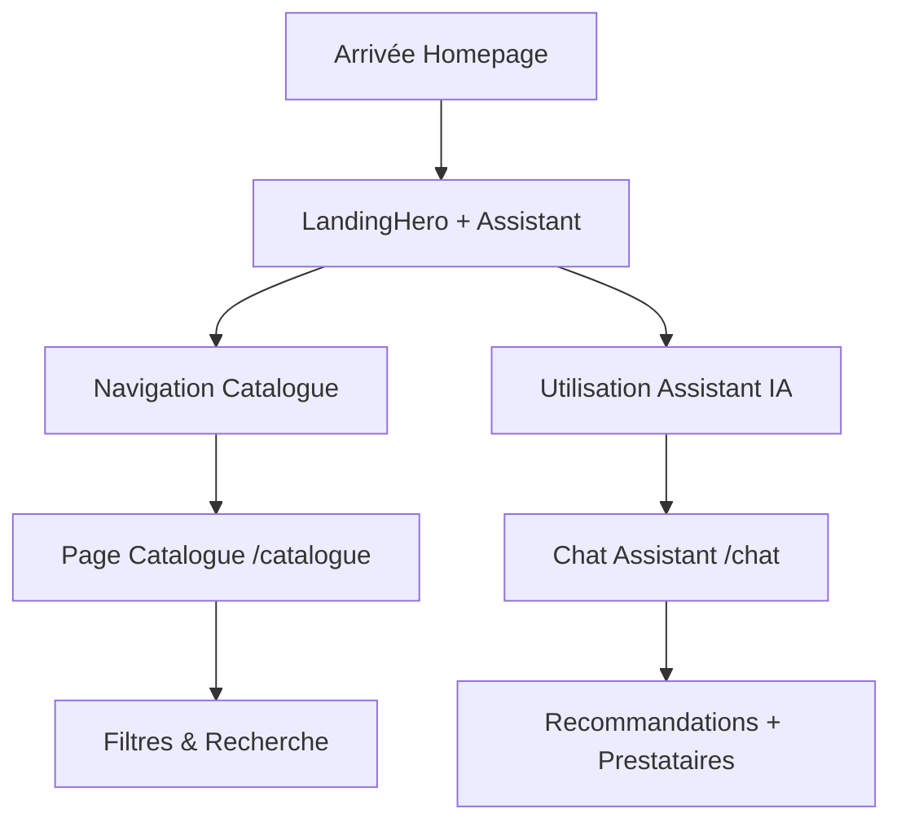
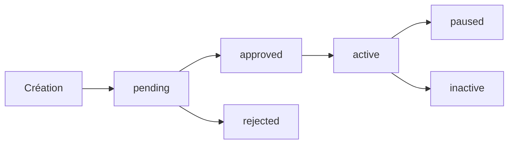
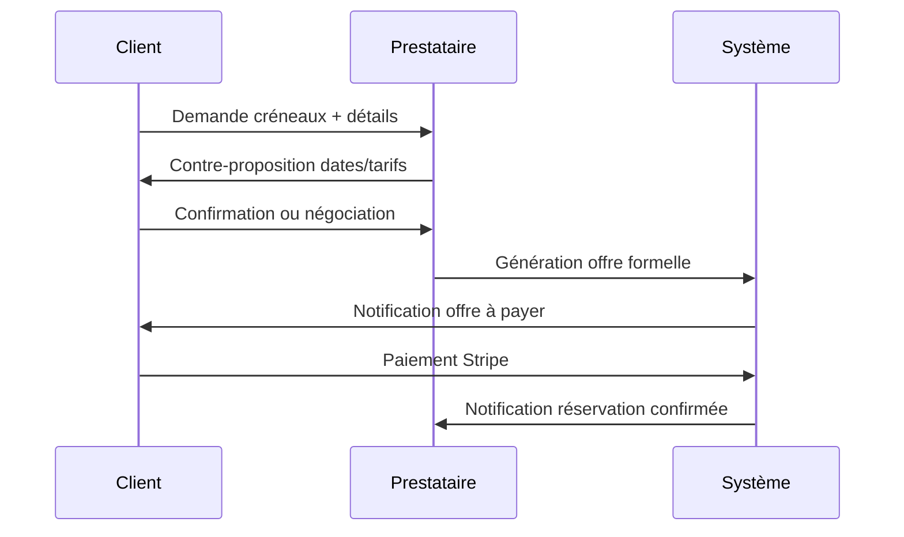

# GetSoundOn - Analyse Technique Complète de la Plateforme

**Analyse réalisée par un Staff Product Engineer + Senior Full-Stack Architect**

---

## Table des Matières

1. [Vue d'Ensemble de la Plateforme](#vue-densemble-de-la-plateforme)
2. [Architecture Technique](#architecture-technique)
3. [Flow Utilisateur Complet - Locataires](#flow-utilisateur-complet---locataires)
4. [Flow Utilisateur Complet - Prestataires](#flow-utilisateur-complet---prestataires)
5. [Système de Paiement & Monétisation](#système-de-paiement--monétisation)
6. [Architecture des Données](#architecture-des-données)
7. [Système d'Authentification & Autorisation](#système-dauthentification--autorisation)
8. [APIs & Intégrations](#apis--intégrations)
9. [Dashboard & Interface Métier](#dashboard--interface-métier)
10. [État Actuel & Limitations](#état-actuel--limitations)
11. [Recommandations Stratégiques](#recommandations-stratégiques)

---

## Vue d'Ensemble de la Plateforme

### Mission & Positionnement

**GetSoundOn** est une marketplace événementielle spécialisée qui met en relation :
- **Loueurs/Clients** : Organisateurs d'événements recherchant du matériel audio/visuel
- **Prestataires/Propriétaires** : Professionnels de l'événementiel proposant leur matériel

### Domaine Métier

```typescript
// Catégories principales
- Sound & Sonorisation
- DJ & Mixage  
- Lighting & Éclairage
- LED Screen & Vidéo
- Microphones & Captation
- Services (livraison, installation, technicien)
```

### Value Proposition

```
Pour les Loueurs : "Trouvez et louez facilement le matériel événementiel dont vous avez besoin"
Pour les Prestataires : "Rentabilisez votre matériel en le proposant à la location"
```

---

## Architecture Technique

### Stack Technologique

```typescript
// Frontend & Framework
- Next.js 16.1.7 (App Router + Server Actions)
- React 18 + TypeScript (strict mode)
- Tailwind CSS + shadcn/ui components
- date-fns (gestion dates) + lucide-react (icônes)

// Backend & Base de Données  
- Supabase (PostgreSQL + Auth + Storage)
- Server-Side Rendering (SSR) + ISR
- API Routes Next.js

// Paiements & Services
- Stripe (paiements + Connect pour marketplace)
- Telegram Bot (notifications)
- Vercel (hébergement)
```

### Architecture de Données

```sql
-- Tables principales (nouvelle architecture gs_*)
gs_users_profile      -- Profils utilisateurs avec rôles
gs_listings          -- Annonces de matériel  
gs_listing_images    -- Images des annonces
gs_bookings          -- Réservations 
gs_messages          -- Système de messagerie
gs_reviews           -- Avis et évaluations

-- Tables legacy (ancienne architecture)
salles               -- Espaces/salles (ancien système)
demandes             -- Demandes de location
offers               -- Offres & réservations
payments             -- Historique paiements
profiles             -- Profils utilisateurs legacy
conversations        -- Messagerie legacy
```

### Architecture de Fichiers

```
app/                     -- Pages Next.js App Router
├── dashboard/          -- Dashboard locataires
├── proprietaire/       -- Dashboard prestataires  
├── boutique/[slug]/    -- Pages prestataires
├── items/[id]/         -- Pages produits individuels
├── api/                -- API Routes
├── auth/               -- Authentification
└── onboarding/         -- Processus d'inscription

components/
├── landing/            -- Homepage & marketing
├── dashboard/          -- Interfaces dashboard
├── items/              -- Composants produits
├── assistant/          -- Assistant événementiel (nouveau)
├── chat/               -- Interface chat (nouveau)
└── ui/                 -- Composants design system

lib/
├── supabase/           -- Configuration & helpers DB
├── stripe/             -- Intégrations paiement  
└── event-assistant/    -- Logic assistant IA
```

---

## Flow Utilisateur Complet - Locataires

### 1. Découverte & Landing



**Pages impliquées :**
- `/` → `/accueil` : Homepage avec assistant événementiel
- `/catalogue` : Recherche & filtrage du matériel
- `/chat` : Assistant conversationnel (nouveau)

### 2. Recherche & Découverte Produits

**Interface de recherche :**
```typescript
// Composants principaux
<ItemsSearchContent />     // Résultats + filtres
<SearchModalButton />      // Modal de recherche rapide
<ProvidersCarousel />      // Carousel prestataires recommandés
```

**Filtres disponibles :**
- Catégorie (sound, dj, lighting, services)
- Localisation géographique  
- Gamme de prix
- Disponibilité dates
- Services (livraison, installation, technicien)

### 3. Page Produit & Réservation

**URL :** `/items/[id]`

**Flow de réservation :**

```typescript
// 1. Consultation produit
const listing = await fetch(`/api/listings/${id}`);

// 2. Sélection dates + montant caution
const bookingData = {
  listingId, startDate, endDate, depositAmount
};

// 3. Création réservation  
const booking = await fetch("/api/bookings", {
  method: "POST", body: JSON.stringify(bookingData)
});

// 4. Paiement Stripe
const checkout = await fetch("/api/stripe/checkout-booking", {
  method: "POST", body: JSON.stringify({ bookingId })
});

// 5. Redirection Stripe Checkout
window.location.href = checkout.url;
```

**Statuts de réservation :**
- `pending` : En attente de paiement
- `paid` : Payée, confirmée
- `active` : En cours (matériel retiré)
- `completed` : Terminée
- `cancelled` : Annulée

### 4. Dashboard Locataire

**URL :** `/dashboard`

**Sections principales :**

```typescript
interface DashboardSeeker {
  // Métriques 30 jours
  demandesEnvoyees: number;
  tauxReponse: number;
  creneauxAcceptes: number; 
  reservationsConfirmees: number;
  
  // Sections
  demandesRecentes: DemandeVisite[];
  conversations: Conversation[];
  favoris: SalleFavorite[];
}
```

**Fonctionnalités :**
- Suivi des demandes de créneaux
- Historique des réservations
- Messagerie intégrée
- Gestion des favoris
- Téléchargement factures

### 5. Pages Additionnelles

```typescript
// Gestion compte
/dashboard/parametres     // Paramètres profil
/dashboard/paiement      // Moyens de paiement
/dashboard/favoris       // Matériel sauvegardé

// Historique & suivi
/dashboard/reservations   // Toutes les réservations  
/dashboard/demandes      // Historique demandes
/dashboard/messagerie    // Conversations prestataires

// Légal & support
/dashboard/contrat       // Contrats & CGV
/dashboard/litiges       // Gestion litiges
/dashboard/etats-des-lieux // États des lieux
```

---

## Flow Utilisateur Complet - Prestataires

### 1. Inscription & Onboarding

**URL :** `/onboarding/salle`

**Processus d'onboarding :**

```typescript
interface OnboardingData {
  // Étape 1: Entreprise
  companyInfo: {
    raisonSociale: string;
    siren?: string;
    adresse: string;
    telephone: string;
  };
  
  // Étape 2: Matériel  
  equipment: {
    category: 'sound' | 'dj' | 'lighting' | 'services';
    brand: string;
    model: string;
    description: string;
    pricePerDay: number;
    images: File[];
  };
  
  // Étape 3: Services
  services: {
    livraison: boolean;
    installation: boolean; 
    technicien: boolean;
    zoneIntervention: string[];
  };
}
```

**Validation & Modération :**
- Vérification SIREN automatique (API entreprise.data.gouv.fr)
- Validation manuelle des photos
- Statuts : `pending` → `approved` → `active`

### 2. Dashboard Prestataire

**URL :** `/proprietaire`

**Vue d'ensemble :**

```typescript
interface DashboardProvider {
  // Métriques business
  demandesRecues30: number;
  tauxReponse30: number;
  creneauxAcceptes30: number;
  revenuEncaisse30: number; // en centimes
  
  // Gestion
  annonces: Listing[];
  demandesVisite: DemandeVisite[];  
  paiements: Payment[];
  stripeAccountId?: string;
}
```

**Indicateurs clés :**
- **Taux de réponse** : % de demandes avec réponse < 24h
- **Taux d'acceptation** : % de créneaux confirmés  
- **Revenue récurrent** : Revenus des 30 derniers jours
- **Note moyenne** : Satisfaction clients

### 3. Gestion des Annonces

**URL :** `/proprietaire/annonces`

**Cycle de vie d'une annonce :**



**Actions disponibles :**
- Modification prix, description, photos
- Gestion calendrier de disponibilité  
- Activation/désactivation rapide
- Analytics performances

### 4. Système de Paiements

**Intégration Stripe Connect :**

```typescript
// Configuration compte Stripe
const stripeAccount = await stripe.accounts.create({
  type: 'express',
  country: 'FR', 
  email: provider.email,
  business_type: 'individual',
  capabilities: {
    card_payments: { requested: true },
    transfers: { requested: true }
  }
});

// Onboarding prestataire
const accountLink = await stripe.accountLinks.create({
  account: stripeAccount.id,
  refresh_url: `${siteConfig.url}/proprietaire/paiement`,
  return_url: `${siteConfig.url}/proprietaire/paiement?setup=success`,
  type: 'account_onboarding'
});
```

**Répartition des revenus :**
- **95% prestataire** + 5% commission GetSoundOn
- Virement automatique J+3 après fin de location
- Gestion cautions automatisée

### 5. Messagerie & Négociation

**URL :** `/proprietaire/messagerie`

**Flow de négociation :**



---

## Système de Paiement & Monétisation

### Architecture Stripe

```typescript
// Configuration principale
const stripe = new Stripe(process.env.STRIPE_SECRET_KEY);

// Types de paiements supportés
interface PaymentTypes {
  'gs_booking': BookingPayment;     // Nouvelles réservations
  'reservation': LegacyReservation; // Ancien système 
  'pass_24h': Pass;                 // Pass découverte
  'abonnement': Subscription;       // Abonnements prestataires
}
```

### Flow de Paiement Complet

**1. Création Session Checkout :**

```typescript
const session = await stripe.checkout.sessions.create({
  mode: "payment",
  line_items: [{
    price_data: {
      currency: "eur",
      product_data: {
        name: `Reservation — ${listingTitle}`,
        description: `${startDate} → ${endDate}`,
      },
      unit_amount: totalCents, // Prix en centimes
    },
    quantity: 1,
  }],
  success_url: `/items/${listingId}?bookingPaid=1&bookingId=${bookingId}`,
  cancel_url: `/items/${listingId}?bookingCancel=1`,
  metadata: {
    product_type: "gs_booking",
    booking_id: bookingId,
    user_id: userId,
    amount_cents: String(totalCents),
    listing_id: listingId,
  },
});
```

**2. Webhook de Confirmation :**

```typescript
// app/api/stripe/webhook/route.ts
export async function POST(request: Request) {
  const signature = request.headers.get("stripe-signature");
  const event = stripe.webhooks.constructEvent(body, signature, webhookSecret);
  
  if (event.type === "checkout.session.completed") {
    const session = event.data.object as Stripe.Checkout.Session;
    
    // Mise à jour statut réservation
    await supabase
      .from("gs_bookings")
      .update({ status: "paid", paid_at: new Date().toISOString() })
      .eq("id", session.metadata?.booking_id);
      
    // Création paiement
    await supabase.from("gs_payments").insert({
      booking_id: session.metadata?.booking_id,
      stripe_session_id: session.id,
      amount: session.amount_total,
      status: "paid"
    });
  }
}
```

### Modèle de Revenus

```typescript
interface RevenueModel {
  // Commission marketplace
  commissionRate: 0.05; // 5% sur chaque transaction
  
  // Frais Stripe
  stripeRate: 0.029 + 0.25; // 2.9% + 0.25€ par transaction
  
  // Revenus additionnels
  premiumListings: 29; // €/mois pour mise en avant
  proSubscription: 49; // €/mois pour prestataires pro
  
  // Calcul répartition
  calculateSplit(totalAmount: number): {
    provider: number;    // 92.1% (après Stripe + commission)
    platform: number;    // 5% commission
    stripe: number;      // 2.9% + 0.25€
  }
}
```

---

## Architecture des Données

### Modèle Relationnel

```sql
-- Utilisateurs & Profils
gs_users_profile (
  id uuid PRIMARY KEY,
  role text CHECK (role IN ('customer', 'provider', 'admin')),
  name, email, phone, avatar,
  stripe_customer_id text,  -- Pour les clients
  stripe_account_id text,   -- Pour les prestataires
  created_at timestamptz
);

-- Annonces matériel
gs_listings (
  id uuid PRIMARY KEY,
  owner_id uuid REFERENCES gs_users_profile(id),
  title text NOT NULL,
  description text NOT NULL, 
  category text CHECK (category IN ('sound', 'dj', 'lighting', 'services')),
  price_per_day numeric(12,2) NOT NULL,
  location text NOT NULL,
  lat/lng double precision,  -- Géolocalisation
  is_active boolean DEFAULT true,
  rating_avg numeric(3,2) DEFAULT 0,
  rating_count integer DEFAULT 0,
  created_at timestamptz
);

-- Images des annonces
gs_listing_images (
  id uuid PRIMARY KEY,
  listing_id uuid REFERENCES gs_listings(id),
  url text NOT NULL,
  position integer DEFAULT 0,
  is_cover boolean DEFAULT false
);

-- Réservations
gs_bookings (
  id uuid PRIMARY KEY,
  listing_id uuid REFERENCES gs_listings(id),
  customer_id uuid REFERENCES gs_users_profile(id), 
  provider_id uuid REFERENCES gs_users_profile(id),
  start_date date NOT NULL,
  end_date date NOT NULL,
  total_price numeric(12,2) NOT NULL,
  deposit_amount numeric(12,2) DEFAULT 0,
  status text DEFAULT 'pending' CHECK (status IN ('pending', 'paid', 'active', 'completed', 'cancelled')),
  paid_at timestamptz,
  created_at timestamptz
);

-- Messagerie
gs_messages (
  id uuid PRIMARY KEY,
  booking_id uuid REFERENCES gs_bookings(id),
  sender_id uuid REFERENCES gs_users_profile(id),
  content text NOT NULL,
  message_type text DEFAULT 'text',
  created_at timestamptz
);

-- Paiements & Facturation  
gs_payments (
  id uuid PRIMARY KEY,
  booking_id uuid REFERENCES gs_bookings(id),
  stripe_session_id text,
  stripe_payment_intent_id text,
  amount integer NOT NULL, -- en centimes
  status text DEFAULT 'pending',
  processed_at timestamptz,
  created_at timestamptz
);

-- Avis & Évaluations
gs_reviews (
  id uuid PRIMARY KEY,
  booking_id uuid REFERENCES gs_bookings(id),
  reviewer_id uuid REFERENCES gs_users_profile(id),
  reviewed_id uuid REFERENCES gs_users_profile(id), -- Prestataire évalué
  rating integer CHECK (rating >= 1 AND rating <= 5),
  comment text,
  created_at timestamptz
);
```

### Système Legacy (Compatibilité)

```sql
-- Tables anciennes maintenues pour compatibilité
salles              -- Espaces physiques (ancien focus)
demandes            -- Système de demandes legacy  
offers              -- Offres & réservations legacy
conversations       -- Messagerie legacy
profiles            -- Profils utilisateurs legacy
favoris             -- Système favoris
```

**Migration Strategy :**
- Nouvelle architecture `gs_*` coexiste avec legacy
- APIs exposent les deux systèmes 
- Migration progressive des données
- Dépréciation prévue des tables legacy

---

## Système d'Authentification & Autorisation

### Supabase Auth

```typescript
// Configuration
const supabase = createClient({
  url: process.env.NEXT_PUBLIC_SUPABASE_URL,
  key: process.env.NEXT_PUBLIC_SUPABASE_ANON_KEY,
});

// Inscription
const { user, error } = await supabase.auth.signUp({
  email, password,
  options: {
    emailRedirectTo: `${siteConfig.url}/auth/callback`,
    data: { full_name, role: 'customer' }
  }
});

// Connexion  
const { user, error } = await supabase.auth.signInWithPassword({
  email, password
});

// OAuth (Google, Facebook)
const { user, error } = await supabase.auth.signInWithOAuth({
  provider: 'google',
  options: { redirectTo: `${siteConfig.url}/auth/callback` }
});
```

### Système de Rôles

```typescript
type UserRole = 'customer' | 'provider' | 'admin';

interface RolePermissions {
  customer: [
    'view_listings',
    'create_bookings', 
    'send_messages',
    'leave_reviews'
  ];
  
  provider: [
    'create_listings',
    'manage_bookings',
    'access_stripe_dashboard',
    'view_analytics'
  ];
  
  admin: [
    'moderate_content',
    'manage_users',
    'access_admin_panel',
    'view_platform_metrics'
  ];
}

// Middleware d'autorisation
async function requireRole(requiredRole: UserRole) {
  const { user } = await supabase.auth.getUser();
  const { data: profile } = await supabase
    .from('gs_users_profile')
    .select('role')
    .eq('id', user.id)
    .single();
    
  if (profile?.role !== requiredRole) {
    throw new Error('Insufficient permissions');
  }
}
```

### Pages Protégées

```typescript
// Middleware de protection des routes
const protectedRoutes = {
  '/dashboard/*': 'customer',
  '/proprietaire/*': 'provider', 
  '/admin/*': 'admin',
  '/onboarding/*': 'authenticated'
};

// Navigation conditionnelle
function NavigationHeader({ user, role }: UserProps) {
  return (
    <nav>
      <Link href="/">Accueil</Link>
      <Link href="/catalogue">Catalogue</Link>
      
      {role === 'customer' && (
        <Link href="/dashboard">Mon Espace</Link>
      )}
      
      {role === 'provider' && (
        <Link href="/proprietaire">Prestataire</Link>
      )}
      
      {role === 'admin' && (
        <Link href="/admin">Administration</Link>
      )}
    </nav>
  );
}
```

---

## APIs & Intégrations

### Structure des APIs

```typescript
// API Routes structure
app/api/
├── bookings/              -- Gestion réservations
│   ├── route.ts          -- POST: créer réservation
│   ├── me/route.ts       -- GET: mes réservations  
│   └── [id]/status/      -- PATCH: update statut
├── listings/             -- Gestion annonces
│   ├── route.ts          -- GET: liste, POST: création
│   └── [id]/route.ts     -- GET: détail annonce
├── messages/             -- Messagerie
│   └── route.ts          -- GET: historique, POST: nouveau
├── stripe/               -- Paiements
│   ├── checkout-booking/ -- Checkout réservation
│   ├── webhook/          -- Webhooks Stripe  
│   ├── connect/          -- Stripe Connect prestataires
│   └── portal/           -- Portail client Stripe
└── cron/                 -- Tâches automatisées
    ├── balance-j-minus-7/ -- Relances paiement
    ├── payout-j-plus-3/   -- Virements prestataires
    └── visit-reminders/   -- Rappels créneaux
```

### APIs Externes

```typescript
interface ExternalIntegrations {
  // Paiements
  stripe: {
    checkout: 'Session de paiement',
    connect: 'Comptes prestataires',
    webhooks: 'Confirmations paiement'
  };
  
  // Entreprises (onboarding)
  dataGouv: {
    endpoint: 'https://api.entreprise.data.gouv.fr/v4/unites_legales/{siren}',
    usage: 'Validation SIREN prestataires'
  };
  
  // Notifications
  telegram: {
    webhook: '/api/telegram/webhook', 
    usage: 'Alertes admin & prestataires'
  };
  
  // Géolocalisation (à implémenter)
  maps: {
    provider: 'Google Maps API',
    usage: 'Calcul distances, autocomplete adresses'
  };
}
```

### Validation & Sécurité

```typescript
// Validation avec Zod
const createBookingSchema = z.object({
  listingId: z.string().uuid(),
  startDate: z.string().date(),
  endDate: z.string().date(), 
  depositAmount: z.number().nonnegative().optional(),
});

// Rate limiting (à implémenter)
const rateLimiter = {
  booking: '10 per minute',
  messaging: '50 per minute',  
  listing: '5 per minute'
};

// CORS & Security Headers
const securityHeaders = {
  'X-Content-Type-Options': 'nosniff',
  'X-Frame-Options': 'DENY',
  'X-XSS-Protection': '1; mode=block',
  'Referrer-Policy': 'strict-origin-when-cross-origin'
};
```

---

## Dashboard & Interface Métier

### Dashboard Locataires (`/dashboard`)

**Métriques principales :**
```typescript
interface SeekerMetrics {
  demandesEnvoyees30j: number;      // Demandes créneaux
  tauxReponse30j: string;           // % réponses reçues  
  creneauxAcceptes30j: number;      // Créneaux confirmés
  reservationsConfirmees30j: number; // Payées & confirmées
}
```

**Sections :**
- **Demandes récentes** : Historique demandes créneaux avec statuts
- **Conversations** : Messagerie prestataires avec preview  
- **Favoris** : Matériel sauvegardé avec accès rapide
- **Quick Actions** : Recherche, nouvelle demande, messagerie

### Dashboard Prestataires (`/proprietaire`)

**Métriques business :**
```typescript
interface ProviderMetrics {
  demandesRecues30j: number;    // Volume demandes
  tauxReponse30j: string;       // % réponse < 24h
  creneauxAcceptes30j: number;  // Créneaux confirmés  
  revenuEncaisse30j: string;    // Revenue net (€)
}
```

**Sections critiques :**
- **Compte Stripe** : Setup paiements Connect + accès dashboard
- **Mes annonces** : Gestion matériel avec statuts modération
- **Calendrier** : Demandes créneaux avec gestion acceptation/refus
- **Paiements** : Historique revenus + virements

### Dashboard Admin (`/admin`)

**Supervision plateforme :**
```typescript
interface AdminDashboard {
  // Modération
  annoncesAValider: Listing[];     // Queue validation
  signalements: Report[];          // Signalements utilisateurs
  litiges: Dispute[];              // Conflits client/prestataire
  
  // Métriques business
  transactionsVolume: number;      // Volume € mensuel
  commissionGenerated: number;    // Revenus commission
  activeProviders: number;        // Prestataires actifs
  activeCustomers: number;        // Clients actifs 
  
  // Opérationnel
  conciergerie: ConciergeRequest[]; // Demandes support
  paiements: Payment[];            // Transactions échouées
  cautions: Deposit[];             // Gestion cautions
}
```

---

## État Actuel & Limitations

### ✅ **Ce qui fonctionne aujourd'hui :**

**Architecture & Technique :**
- ✅ Next.js 16 avec App Router configuré
- ✅ Supabase Auth + Database opérationnels
- ✅ Stripe Connect intégré (paiements marketplace)
- ✅ Architecture gs_* (nouvelle) + legacy coexistante
- ✅ API Routes complètes pour booking flow
- ✅ Assistant événementiel IA fonctionnel

**Flow Utilisateur :**
- ✅ Inscription/connexion multi-rôles
- ✅ Onboarding prestataires avec validation SIREN
- ✅ Création et gestion d'annonces matériel
- ✅ Process de réservation complet (sélection → paiement → confirmation)
- ✅ Dashboards différenciés par rôle
- ✅ Messagerie basique intégrée

**Business & Paiements :**
- ✅ Commission 5% sur transactions
- ✅ Virements automatiques prestataires (J+3)
- ✅ Gestion des cautions
- ✅ Facturation et contrats PDF

### ⚠️ **Limitations identifiées :**

**UX & Interface :**
- ⚠️ Experience mobile non optimisée
- ⚠️ Assistant IA parfois répétitif (redemande dates)
- ⚠️ Recherche/filtres basiques (pas de géolocalisation fine)
- ⚠️ Pas de notifications push/email automatiques
- ⚠️ Interface messagerie peu intuitive

**Business & Fonctionnel :**
- ⚠️ Pas de système de notation/avis
- ⚠️ Gestion inventaire manuelle (pas de calendrier de disponibilité)
- ⚠️ Pas de recommendations personnalisées
- ⚠️ Analytics limités pour les prestataires
- ⚠️ Pas de support multi-devises

**Technique & Scalabilité :**
- ⚠️ Migration legacy incomplète (double schéma)
- ⚠️ Pas de cache (Redis) pour les recherches
- ⚠️ Rate limiting non implémenté
- ⚠️ Monitoring/observability manquant
- ⚠️ Tests automatisés insuffisants

**Sécurité & Compliance :**
- ⚠️ RGPD partiellement implémenté
- ⚠️ Audit de sécurité non réalisé  
- ⚠️ Logs d'audit insuffisants
- ⚠️ Backup strategy non documentée

---

## Recommandations Stratégiques

### 🎯 **Priorité 1 - Stabilisation & UX (Q1 2026)**

```typescript
interface Q1Roadmap {
  // UX Critical
  mobileOptimization: 'Responsive design complet';
  assistantFixes: 'Correction bugs répétition questions';
  searchUpgrade: 'Géolocalisation + filtres avancés';
  notificationsSystem: 'Email + push pour événements clés';
  
  // Business Critical  
  reviewsSystem: 'Notes & avis après chaque location';
  calendarManagement: 'Disponibilité matériel en temps réel';
  inventoryTracking: 'Gestion stock automatisée';
  
  // Tech Debt
  legacyMigration: 'Finaliser migration vers gs_* schema';
  performanceOptimization: 'Cache + optimisation requêtes';
  testingFramework: 'Tests E2E + unit tests';
}
```

### 🚀 **Priorité 2 - Croissance & Scale (Q2-Q3 2026)**

```typescript
interface GrowthPhase {
  // Features Business
  dynamicPricing: 'Prix dynamiques par demande/saison';
  subscriptionTiers: 'Abonnements prestataires (Basic/Pro/Premium)';
  referralProgram: 'Programme parrainage avec rewards';
  corporateAccounts: 'Comptes entreprise avec facturation centralisée';
  
  // Expansion Géographique
  multiCity: 'Déploiement Paris → Lyon → Marseille';
  localizedContent: 'Contenus adaptés par région';
  
  // Intelligence & Automation
  mlRecommendations: 'Recommandations IA basées sur historique';
  predictiveInventory: 'Prédiction demande & optimisation stock';
  automatedSupport: 'Chatbot support client niveau 1';
  
  // Intégrations
  accountingSoftware: 'QuickBooks, Sage, Xero';
  eventPlatforms: 'Eventbrite, Meetup, Facebook Events';
  logisticsPartners: 'Transporteurs spécialisés événementiel';
}
```

### 💡 **Priorité 3 - Innovation & Différenciation (Q4 2026)**

```typescript
interface InnovationPhase {
  // Advanced Features
  arVisualization: 'Visualisation AR du matériel in-situ';
  iotIntegration: 'Capteurs IoT sur matériel haut de gamme';
  blockchainProofOfUse: 'Blockchain pour preuves d\'utilisation';
  
  // Marketplace Evolution
  serviceProfessionals: 'Marketplace techniciens/DJ/ingénieurs son';
  eventPlanningTools: 'Suite complète planification événement';
  liveSupport: 'Support technique en direct pendant événements';
  
  // Data & Analytics
  eventROIAnalytics: 'Mesure ROI événements clients';
  marketInsights: 'Insights marché pour prestataires';
  demandForecasting: 'Prévision demande par région/saison';
}
```

### 📊 **KPIs & Métriques de Succès**

```typescript
interface SuccessMetrics {
  // Croissance
  monthlyActiveUsers: 'Objectif: 10k MAU Q4 2026';
  transactionVolume: 'Objectif: 2M€ GMV mensuel Q4 2026';
  providerRetention: 'Objectif: 80% retention an 1';
  customerLTV: 'Objectif: 800€ LTV moyenne';
  
  // Qualité
  nps: 'Objectif: NPS > 70';
  timeToFirstBooking: 'Objectif: < 2h après inscription';
  disputeRate: 'Objectif: < 2% transactions';
  
  // Opérationnel  
  averageResponseTime: 'Objectif: < 2h réponse prestataires';
  paymentSuccessRate: 'Objectif: > 99% paiements réussis';
  platformUptime: 'Objectif: 99.9% uptime';
}
```

### 💰 **Projection Business Model**

```typescript
interface RevenueProjection2026 {
  // Revenue Streams
  transactionCommission: {
    rate: '5%',
    monthly: '50k€ → 100k€', // Q1 → Q4 2026
    annual: '900k€'
  };
  
  subscriptions: {
    basicPro: '29€/mois × 500 prestataires = 14.5k€/mois',
    premiumPro: '79€/mois × 150 prestataires = 11.8k€/mois', 
    annual: '315k€'
  };
  
  additionalServices: {
    insurance: '3€ par transaction × 8k/mois = 24k€/mois',
    photography: '150€ × 200/mois = 30k€/mois',
    annual: '648k€'  
  };
  
  totalProjection: '1.86M€ ARR en fin 2026';
}
```

---

## Conclusion

**GetSoundOn dispose d'une base technique solide** avec une architecture moderne (Next.js + Supabase + Stripe) et un flow de réservation fonctionnel. 

**Les prochaines étapes critiques** sont la stabilisation UX (mobile, assistant, recherche) et l'ajout de fonctionnalités business essentielles (avis, calendriers, notifications).

**Le potentiel de croissance est significatif** avec un marché événementiel français de 7.5Md€ et une proposition de valeur claire pour les deux côtés de la marketplace.

**L'architecture permet de scale** vers 10k+ utilisateurs et des millions d'euros de GMV avec les optimisations recommandées.

---

*Cette analyse complète fournit une roadmap claire pour transformer GetSoundOn en leader du matériel événementiel en France.* 🎵🚀